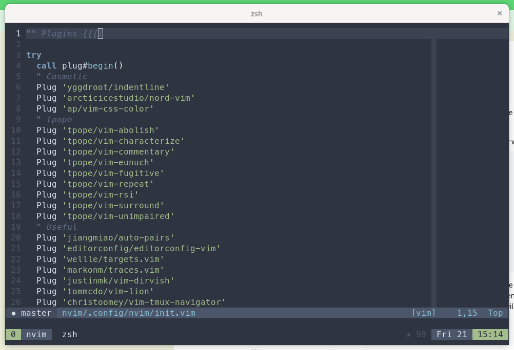

# ~/dotFiles



## How to

To configure everything use the `install.sh` script. Make sure to make it executable with:
```
chmod +x ~/dotFiles/install.sh
```
To use this script you will need GNU Stow, which can be installed with your package manager of choice. With Mac OS X I prefer to use [homebrew](https://brew.sh).
```
brew install stow
```

## Zsh
I like to use zsh as my shell, and [Antigen](https://github.com/zsh-users/antigen) to configure plugins and my prompt of choice, [powerlevel10k](https://github.com/romkatv/powerlevel10k).
If you want to explore more of the features of zsh, my framework of choice is [Prezto](https://github.com/sorin-ionescu/prezto).
I agree with most of the defaults and on my machine it performs better than [Oh My Zsh](https://github.com/ohmyzsh/ohmyzsh).

## Neovim

For my nvim setup I use the [vim-plug](https://github.com/junegunn/vim-plug) package manager which can be setup using:
```
sh -c 'curl -fLo "${XDG_DATA_HOME:-$HOME/.local/share}"/nvim/site/autoload/plug.vim --create-dirs \
       https://raw.githubusercontent.com/junegunn/vim-plug/master/plug.vim'
```

## Favorite terminal programs

Here is a list of the terminal applications I use the most often:
```
tmux                # Terminal multiplexer
fzf                 # Fuzzy finder, for files, etc.
ddgr                # DuckDuckGo from the terminal
nnn                 # A light terminal file browser
ripgrep             # Very fast regex file search
mpd mpc ncmpcpp mpv # For playing music, videos
ffmpeg              # Video and audio tools
neofetch            # For displaying sys info
git vim python      # Mac versions are old....
coreutils           # GNU versions of less, etc.
bat                 # `cat` w/ syntax highlighting
htop                # A better version of `top`
ncdu                # `du` w/ a TUI and more features
tldr                # When `man` is too long
jq                  # A commandline JSON processor
```

## Colors

For the most part I prefer to use base16 colors, so the terminal colors you use in iTerm, or your terminal of choice, will largely determine the appearance of the packages installed.
I have recently been using the popular [nord](https://www.nordtheme.com/) theme.
To load these colors into iTerm, you will need follow this [guide](https://github.com/arcticicestudio/nord-iterm2).

## Font

I use the Meslo Nerd Font patched for powerlevel10k, which can be installed by following [this guide](https://github.com/romkatv/powerlevel10k#meslo-nerd-font-patched-for-powerlevel10k).

